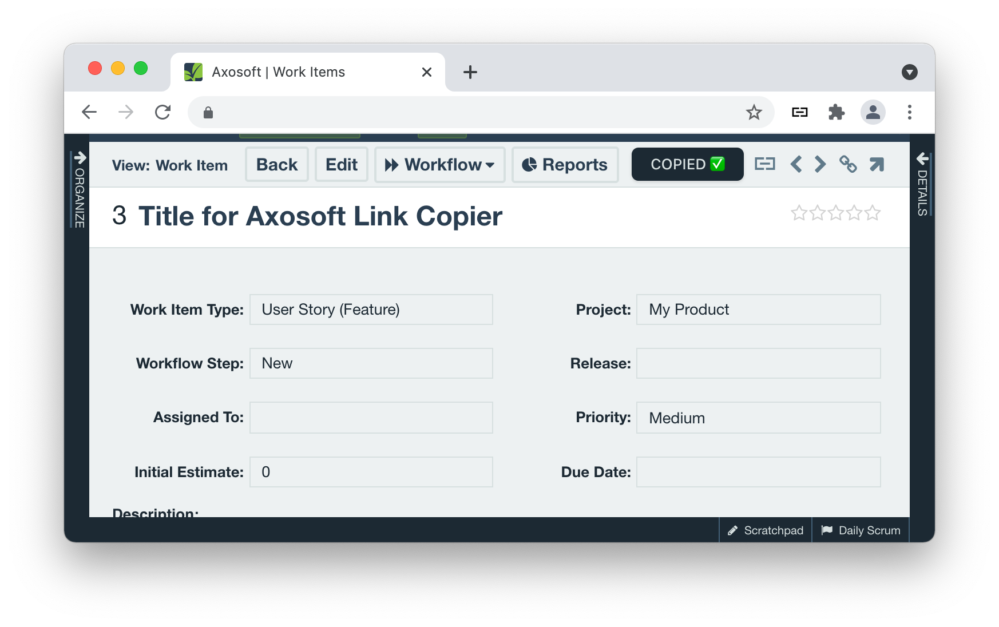

# Axosoft Link Copier

This is a Firefox and Chromium browser extension which allows you to copy nice links of an Axosoft item to your clipboard.

 

## Features

- Button to copy link to current Axosoft item
- Possibility to change delimiter between item number and title
- Possibility to enable a shortcut for even faster copy

## Downloads

- [Firefox](https://addons.mozilla.org/en-GB/firefox/addon/axosoft-link-copier/)
- [Chromium](https://chrome.google.com/webstore/detail/axosoft-link-copier/hegmcnlplcgnkbgcgjeaahhccocffllg)

## Shoutouts

A massive shoutout goes out to [@antfu](https://github.com/antfu) who provided the base of this project with the [vitesse-webext](https://github.com/antfu/vitesse-webext) template. Thank you 🎉
